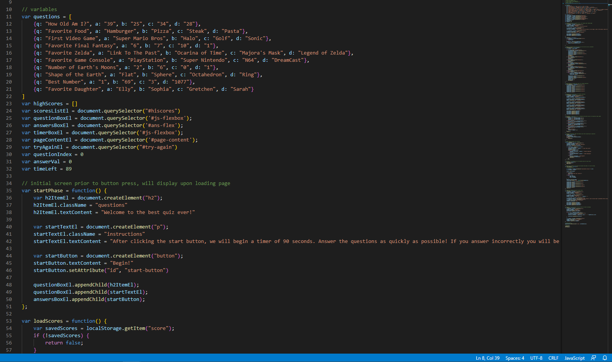
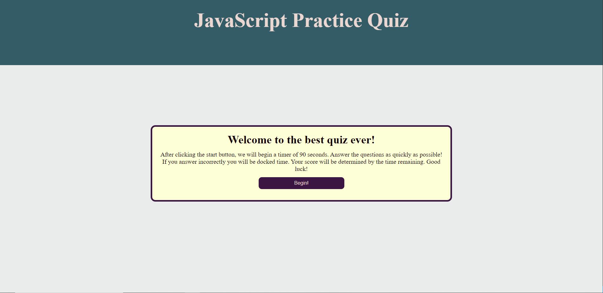

# javascript-quiz

## Description

This application is a small quiz powered almost entirely by JavaScript. All of the HTML changes are DOM updates done via JS with little hard HTML. This application uses localStorage to record highscores and will display all of your scores at the end of the quiz. The quiz itself is just some random facts about myself. 

## Website

The live website can be found at https://uberbrent.github.io/javascript-quiz/

## Screenshots
Example of the updated HTML for easier reading:

Example of the CSS consolidation with notes:

